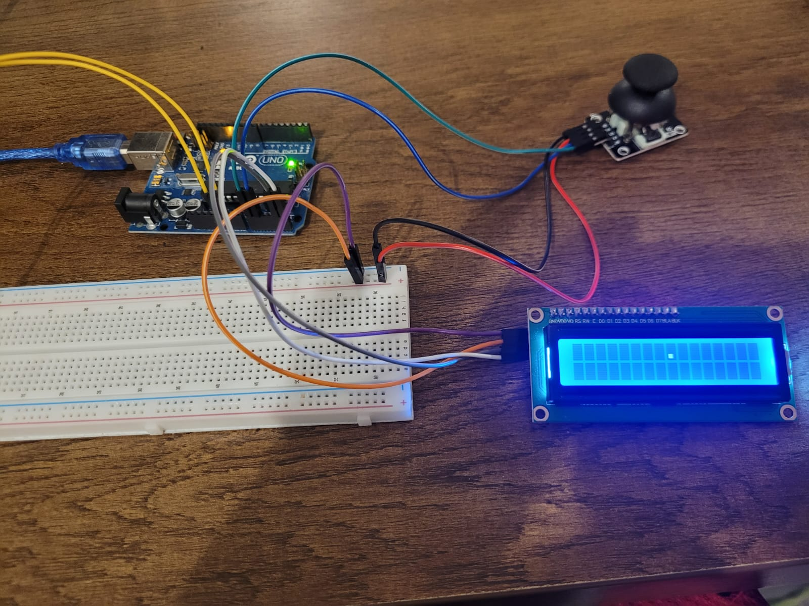
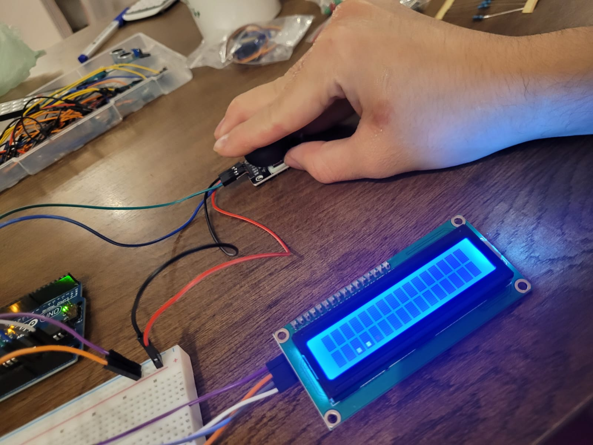

# Arduino---Joystick-Controlled-Dot-on-LCD


# Description:
Arduino---Joystick-Controlled-Dot-on-LCD

This project uses an Arduino, a joystick module, and an LCD display to simulate simple directional control of a point (or cursor) on the screen.

---

How it works:

A single character or dot is displayed on the LCD.

Using the joystick, the user can move the dot left, right, up, or down.

The dot moves within the first and second rows of the LCD, allowing basic 2D navigation.

The screen updates in real-time based on joystick movement, giving the feeling of interactive control.

---

This project is a fun and simple example of how to use analog joystick inputs to control cursor movement on an LCD display.


# Pictures:




# Code Below:
```cpp
#include <LiquidCrystal_I2C.h>

LiquidCrystal_I2C lcd(0x27, 16, 2);


byte joyX = A1;
byte joyY = A0;


int xRead;
int yRead;
int lastXRead;
byte positionX = 0;

void setup() {
  lcd.init();
  lcd.backlight();
  lcd.setCursor(0,0);
  lcd.print('.');
}

void loop() {
  xRead = analogRead(joyX);
  yRead = analogRead(joyY);

  positionX = map(xRead, 0, 1023, 0, 16);
  
  if (xRead != lastXRead){

    lcd.clear();
    
    if (yRead < 512) {
      lcd.setCursor(positionX, 0);
    }

    if (yRead >= 512) {
      lcd.setCursor(positionX, 1);
    }

    lcd.print('.');

  }

  lastXRead = xRead;

  delay(50);
}
```
